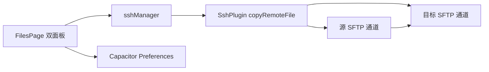

# Dual Pane File Manager

Feature Name: dual-pane-file-manager
Updated: 2026-07-18

## Description

文件页面使用主文件面板和目标文件面板呈现两个独立目录。顶栏提供服务器切换、目录跳转和当前工作区工具。复制操作直接调用 Android 原生插件，在两个 SFTP 通道之间以流方式传送单个文件。

## Architecture

## Components and Interfaces

- `FilesPage.tsx`: 保存右侧面板服务器、路径和文件列表状态，并提供双向复制控件。
- `sshManager.copyRemoteFile`: 将服务器 ID 转换为原生连接 ID。
- `SshPlugin.copyRemoteFile`: 验证两个连接和路径后执行异步复制。
- `SshConnection.copyFileTo`: 打开源与目标 SFTP 通道，并把源输入流传给目标写入操作。
- `storage.loadValue` 与 `storage.saveValue`: 读取和写入命名书签、服务器首页目录，网页环境使用 `localStorage` 回退。
- 顶栏抽屉: 左侧展示服务器搜索和连接状态；中部验证目录跳转；右侧操作当前活动面板。
- 右侧文件工具: 使用安全区内的右上浮层，排序设置使用独立居中模态框。
- 排序持久化: `file_sort_modes`、`file_sort_directions` 和 `file_folder_sorts` 分别保存服务器默认排序、逆向状态和目录覆盖规则。
- 搜索与返回: 搜索弹窗将查询词写入当前目录过滤状态；`app-back-button` 事件按弹窗、选择状态和父级目录的优先级消费 Android 返回事件。
- 紧凑列表: 文件行使用 32px 浅色阴影图标和两行元数据区域，图标点击与行长按共享同一操作菜单入口；非活动面板使用内阴影标记。
- 移动策略: 同服务器移动调用远程 `mv`；跨服务器单个文件先走 SFTP 流式复制，目标成功后删除源文件；文件夹下载通过服务器 `tar` 生成压缩包后加入下载任务。

## Correctness Properties

- 左右面板的目录状态独立，因此同一服务器可以展示两个不同路径。
- 复制仅在源文件和目标目录所在连接均可用时运行。
- 复制完成后目标列表重新加载。
- 命名书签和首页目录按服务器 ID 保存，切换服务器时使用对应首页目录。
- 文件行选择状态由服务器 ID、面板和文件名共同确定，避免双面板同名文件共享选中样式。

## Error Handling

- 连接或路径缺失时，前端提示用户连接两个面板。
- SFTP 读取、写入或权限错误由原生层返回失败状态，前端提示目标目录权限检查。
- 跳转目录无法加载时，前端保留当前目录并显示路径或权限错误。

## Test Strategy

- TypeScript 构建验证前端类型和 JSX。
- Android Debug 构建验证 Capacitor 插件与 Java 原生代码。
- 真机验证覆盖同服务器跨目录复制和跨服务器复制。
