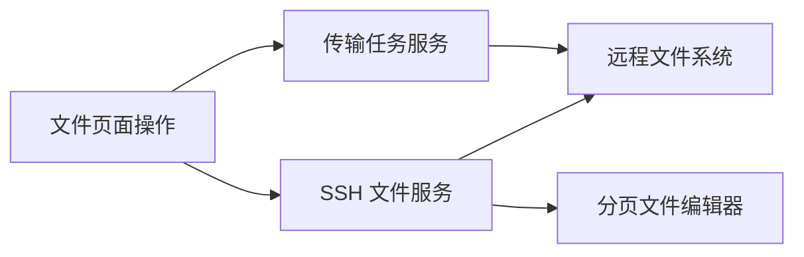

# 文件页面功能同步设计

Feature Name: file-page-feature-parity
Updated: 2026-07-17

## 描述

独立文件页面复用现有 SSH 和传输服务，将终端文件面板的独有操作复制到独立页面，同时维持当前列表、卡片和工具栏视觉结构。

## 架构

## 组件与接口

- `FilesPage`：管理新建文件、文件夹上传、编辑器与页面现有文件列表。
- `sshManager.uploadDirectory`：调用 Android 原生目录选择与递归上传。
- `sshManager.readFileChunk`：读取连续文件区块并提供分页元数据。
- `transferManager`：维持普通文件上传和下载任务状态。

## 正确性属性

- 文件夹上传的远程目标路径等于当前目录。
- 文件保存始终使用编辑器打开时记录的远程路径。
- 分页预览区块按照字节偏移连续读取。

## 错误处理

- 文件读取、写入和上传失败时展示错误提示并保留当前文件列表。
- 大文件编辑器以只读分页方式显示，避免写入部分文件内容。

## 测试策略

- 验证当前目录中的文件和文件夹创建。
- 验证目录选择、递归上传和进度反馈。
- 验证常规文件编辑、保存与刷新。
- 验证大文件分页与搜索导航。
