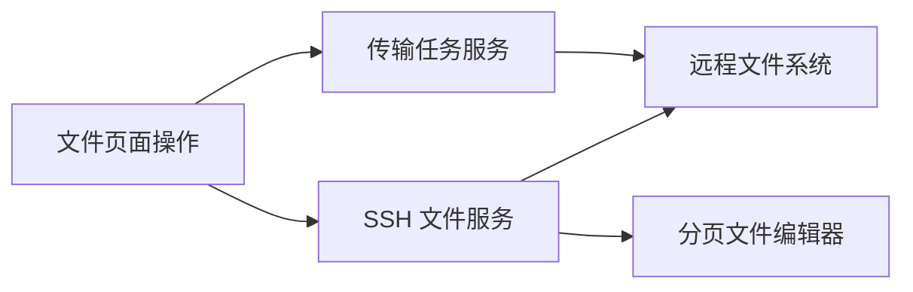

# 文件页面功能同步设计

Feature Name: file-page-feature-parity
Updated: 2026-07-20

## 描述

独立文件页面复用现有 SSH 和传输服务，将终端文件面板的独有操作复制到独立页面，同时维持当前列表、卡片和工具栏视觉结构。

## 架构

## 组件与接口

- `FilesPage`：管理新建文件、文件夹上传、编辑器与页面现有文件列表。
- `sshManager.uploadDirectory`：调用 Android 原生目录选择与递归上传。
- `sshManager.readFileChunk`：读取连续文件区块并提供分页元数据。
- `transferManager`：维持普通文件上传和下载任务状态。
- `FilesPage` 长按菜单：根据源面板推导相反的目标面板，并在操作期间显示居中进度弹窗。
- `FilesPage` 属性弹窗：显示列表元数据，并提供权限与修改时间的二级操作。
- `FilesPage` 书签抽屉：监听文件页底栏上滑事件，从本地存储读取书签与分组，并将书签路径导航至活动面板。
- `BottomNav`：在文件页识别向上滑动手势并派发书签抽屉打开事件。
- 书签抽屉分组标签：使用本地存储的顺序数组渲染，支持长按排序、重命名和删除。
- 最近记录：每次目录导航时按服务器与路径去重，保留最近 30 条记录。

## 正确性属性

- 文件夹上传的远程目标路径等于当前目录。
- 文件保存始终使用编辑器打开时记录的远程路径。
- 分页预览区块按照字节偏移连续读取。
- 文件编辑器保存始终使用编辑器打开时记录的服务器标识和完整路径。
- 文件列表的异步结果仅在对应面板仍为最新请求时写入状态。
- 全选操作仅保存活动面板和活动服务器下的当前目录条目名称。
- 书签分组与抽屉高度设置保存在本地存储，页面重载后保持可用。
- 最近记录按服务器标识和路径去重，保存顺序与最近访问时间一致。

## 错误处理

- 文件读取、写入和上传失败时展示错误提示并保留当前文件列表。
- 大文件编辑器以只读分页方式显示，避免写入部分文件内容。

## 测试策略

- 验证当前目录中的文件和文件夹创建。
- 验证目录选择、递归上传和进度反馈。
- 验证常规文件编辑、保存与刷新。
- 验证大文件分页与搜索导航。
