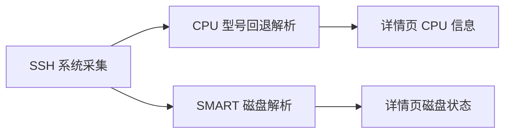

# 硬件详情增强设计

Feature Name: hardware-detail-enhancements
Updated: 2026-07-17

## 描述

详情页通过现有 SSH 采集流程获取 CPU 和 SMART 数据，并将每块磁盘的健康状态和温度呈现在磁盘卡片中。

## 架构



## 组件与接口

- `ServerDetail.fetchData`：生成跨架构 CPU 查询脚本和每块磁盘的 SMART 查询脚本。
- `parseDiskHealth`：将以竖线分隔的 SMART 结果转为设备、状态和温度对象。
- 磁盘状态视图：根据健康状态选择绿色正常徽标或警示色徽标。

## 数据模型

```ts
interface DiskHealth {
  device: string
  status: string
  temperature: number
}
```

## 正确性属性

- 每条 SMART 结果只对应一个设备。
- 健康状态与温度由同一块设备的 SMART 输出生成。
- 缺失 SMART 信息不影响文件系统用量、CPU 信息和网络信息展示。

## 错误处理

- `smartctl` 缺失、超时或无法读取设备时，采集结果忽略该设备。
- CPU 型号字段缺失时，页面展示 `uname -m` 输出。

## 测试策略

- 验证 x86 的 `model name` 输出。
- 验证 ARM 的 `Hardware` 与 `Processor` 输出。
- 验证 SMART 正常状态呈现绿色“正常”和温度。
- 验证无 SMART 数据时磁盘容量列表正常展示。
