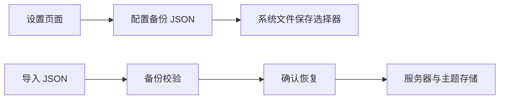

# 设置页滚动与配置备份设计

Feature Name: settings-backup
Updated: 2026-07-17

## 描述

设置页面提供可滚动内容容器，以及基于 JSON 文件的服务器配置备份和恢复。Android 使用 `ACTION_CREATE_DOCUMENT` 打开系统文件管理器的目录和文件名选择界面。

## 架构



## 数据模型

```ts
interface ConfigBackup {
  version: 1
  exportedAt: string
  theme: 'dark' | 'light' | 'system'
  servers: Server[]
}
```

## 正确性属性

- 导出文件包含完整服务器配置。
- 默认文件名包含毫秒级时间戳，便于保留多份备份。
- 导入前校验备份版本、服务器数组和服务器标识字段。
- 导入确认后，当前服务器连接关闭，服务器列表使用导入数据替换。

## 错误处理

- 文件读取或 JSON 解析失败时展示错误提示。
- 非法备份结构不改变当前配置。

## 测试策略

- 验证设置页在小屏幕上滚动。
- 验证导出 JSON 包含主题和服务器配置。
- 验证有效备份导入后替换服务器列表。
- 验证无效 JSON 文件显示错误提示。
