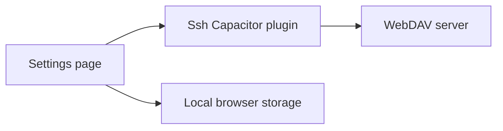

# WebDAV Backup and Restore

Feature Name: webdav-backup
Updated: 2026-07-17

## Description

The settings page stores WebDAV connection details locally and delegates WebDAV requests to the Android plugin. The plugin performs PUT, PROPFIND, and GET requests, avoiding WebView cross-origin restrictions.

## Architecture

## Components and Interfaces

- `Settings.tsx` owns the centered configuration form, connection-test state, JSON serialization, import confirmation, and remote backup selection.
- `SshPlugin.java` performs authenticated WebDAV requests and returns file names or Base64 encoded content. `OPTIONS` validates endpoint capability and OkHttp performs the custom `PROPFIND` directory listing method.
- `ssh.ts` declares the Capacitor bridge methods.

## Data Models

`WebDavConfig` contains `url`, `username`, `password`, and `path`. Backup content uses the existing version 1 configuration schema.

## Correctness Properties

- A backup file name starts with `server-monitor-backup-` and includes a timestamp.
- Restoration accepts only data that satisfies the existing configuration backup validator.
- Upload and download use the configured directory and URL encoded file names.

## Error Handling

The plugin sets finite connect and read timeouts. An OPTIONS request verifies the configured HTTP WebDAV endpoint and requires a DAV response header. The test then uploads and removes a timestamped temporary file to verify directory write access before configuration persistence. HTTP response failures include the status code. The UI surfaces validation, test, upload, listing, download, and parsing failures using toasts.

## Test Strategy

- TypeScript production build validates the bridge and settings UI.
- Android debug build validates Java compilation and Capacitor synchronization.
- Device validation covers PUT backup, PROPFIND listing, GET restoration, cancellation, authentication failure, and malformed JSON.
